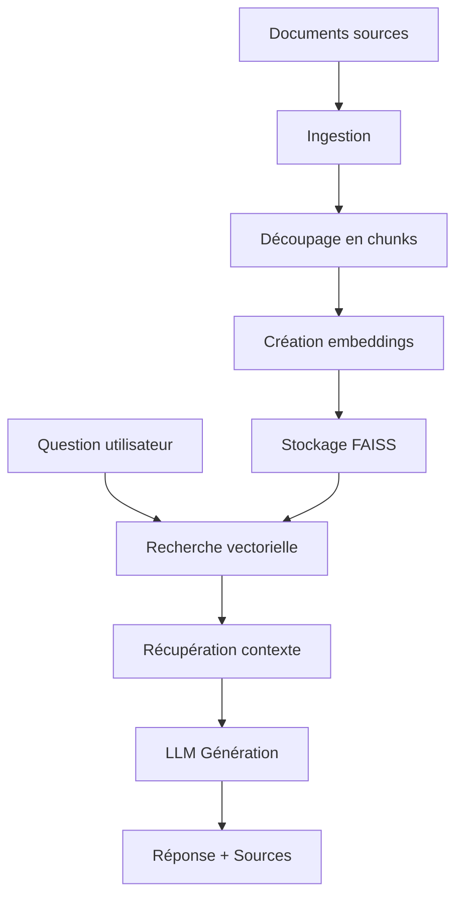

# 📚 Documentation - Chatbot IA avec Base Documentaire

> **Projet BTS SIO SLAM** - Assistant intelligent utilisant RAG (Retrieval-Augmented Generation)

## 📋 Table des matières

- [Présentation du projet](#-présentation-du-projet)
- [Architecture technique](#-architecture-technique)
- [Installation et configuration](#-installation-et-configuration)
- [Guide d'utilisation](#-guide-dutilisation)
- [API et fonctionnalités](#-api-et-fonctionnalités)
- [Développement](#-développement)
- [Déploiement](#-déploiement)
- [Dépannage](#-dépannage)

---

## 🎯 Présentation du projet

### Objectif
Développer un chatbot intelligent capable d'analyser et de répondre aux questions basées sur une base documentaire personnalisée, en utilisant les technologies d'IA modernes.

### Fonctionnalités principales
- **📖 Analyse de documents** : Support multiple formats (TXT, MD, PDF, code source)
- **🤖 IA conversationnelle** : Réponses contextuelles avec historique
- **🔍 Recherche vectorielle** : Indexation et recherche sémantique
- **📊 Interface moderne** : Dashboard Streamlit intuitif
- **🔧 Multi-providers** : Support OpenAI et Mistral AI

### Technologies utilisées
- **Backend** : Python 3.11+, LangChain, FAISS
- **Frontend** : Streamlit
- **IA/ML** : OpenAI GPT, Mistral AI, embeddings vectoriels
- **Traitement documents** : PyMuPDF, python-docx
- **Déploiement** : GitHub Codespaces, Docker

---

## 🏗️ Architecture technique

### Structure du projet
```
Projet_IA_BTS-SIO/
├── 📁 .devcontainer/           # Configuration GitHub Codespaces
│   └── devcontainer.json
├── 📁 app/                     # Application principale
│   ├── __init__.py
│   ├── config.py              # Configuration et variables
│   ├── ingest.py              # Ingestion des documents
│   ├── qa_chain.py            # Chaîne QA et logique IA
│   └── main.py                # Interface Streamlit
├── 📁 data/                   # Documents sources (auto-généré)
├── 📁 vectorstore/            # Base vectorielle FAISS (auto-généré)
├── 📄 requirements.txt        # Dépendances Python
├── 📄 .env                    # Variables d'environnement
├── 📄 .gitignore
└── 📄 README.md
```

### Flux de données


### Composants principaux

#### 1. **DocumentIngestor** (`ingest.py`)
- Chargement multi-formats
- Découpage intelligent des documents
- Création d'embeddings vectoriels
- Stockage dans FAISS

#### 2. **QAChain** (`qa_chain.py`)
- Interface avec les LLMs (OpenAI/Mistral)
- Gestion de l'historique conversationnel
- Recherche et récupération de contexte
- Scoring de confiance

#### 3. **Interface Streamlit** (`main.py`)
- Dashboard principal
- Upload et gestion de fichiers
- Chat interactif
- Visualisation des résultats

---

## ⚙️ Installation et configuration

### Prérequis système
- **Python** : 3.11 ou supérieur
- **Git** : Pour le clonage de repositories
- **Clé API** : OpenAI ou Mistral AI

### Installation locale

#### 1. Cloner le projet
```bash
git clone https://github.com/votre-username/Projet_IA_BTS-SIO.git
cd Projet_IA_BTS-SIO
```

#### 2. Créer un environnement virtuel
```bash
python -m venv venv

# Windows
venv\Scripts\activate

# Linux/Mac
source venv/bin/activate
```

#### 3. Installer les dépendances
```bash
pip install -r requirements.txt
```

#### 4. Configuration des variables d'environnement
```bash
cp .env.example .env
# Éditer le fichier .env avec vos clés API
```

### Configuration avec GitHub Codespaces

1. **Fork** le repository
2. Cliquer sur **Code > Codespaces > Create codespace**
3. Attendre l'initialisation automatique
4. Configurer le fichier `.env`
5. Lancer l'application

### Variables d'environnement

#### Configuration obligatoire
```bash
# Provider principal (openai ou mistral)
PROVIDER=mistral
MISTRAL_API_KEY=votre_cle_mistral_ici

# Pour les embeddings (si pas d'OpenAI, utiliser embeddings gratuits)
OPENAI_API_KEY=votre_cle_openai_ici
```

#### Configuration avancée
```bash
# Modèles
MODEL_NAME=mistral-small              # ou gpt-3.5-turbo
EMBEDDING_MODEL=text-embedding-ada-002

# Traitement des documents
CHUNK_SIZE=1000                       # Taille des segments
CHUNK_OVERLAP=200                     # Chevauchement

# Recherche
MAX_RESULTS=4                         # Nombre de résultats max
SIMILARITY_THRESHOLD=0.7              # Seuil de similarité

# Repository par défaut (optionnel)
REPO_URL=https://github.com/user/docs.git
```

---

## 📖 Guide d'utilisation

### Première utilisation

#### 1. Lancer l'application
```bash
streamlit run app/main.py
```
L'interface s'ouvre automatiquement sur `http://localhost:8501`

#### 2. Indexer des documents

**Option A : Repository Git**
- Sidebar > Onglet "Repository"
- Entrer l'URL du repository
- Cliquer "Cloner et indexer"

**Option B : Upload de fichiers**
- Sidebar > Onglet "Upload"
- Sélectionner les fichiers
- Cliquer "Uploader et indexer"

#### 3. Commencer à converser
- Utiliser la zone de chat principale
- Poser des questions sur les documents
- Explorer les sources des réponses

### Interface utilisateur

#### Sidebar (panneau latéral)
- **⚙️ Configuration** : Informations sur le provider et modèle
- **📁 Gestion des documents** : Upload et indexation
- **📊 Statistiques** : Métriques du vectorstore

#### Zone principale
- **💬 Conversation** : Chat interactif avec l'IA
- **🔍 Outils d'analyse** : Recherche et exploration

#### Fonctionnalités avancées
- **Historique contextuel** : Maintien du contexte sur plusieurs échanges
- **Sources traçables** : Références exactes aux documents
- **Export conversations** : Sauvegarde en Markdown
- **Questions suggérées** : Exemples pour commencer

### Formats de documents supportés

| Format | Extension | Description |
|--------|-----------|-------------|
| **Texte** | `.txt`, `.md` | Fichiers texte et Markdown |
| **Code** | `.py`, `.js`, `.html`, `.css` | Code source |
| **Données** | `.json`, `.xml` | Fichiers structurés |
| **PDF** | `.pdf` | Documents PDF (version avancée) |

---

## 🔧 API et fonctionnalités

### Classes principales

#### `DocumentIngestor`
```python
from app.ingest import SimpleDocumentIngestor

# Initialisation
ingestor = SimpleDocumentIngestor()

# Méthodes principales
ingestor.clone_repository(repo_url)           # Cloner un repo
ingestor.load_documents_from_directory()      # Charger documents locaux
ingestor.upload_documents(uploaded_files)     # Traiter uploads
ingestor.create_vectorstore(documents)        # Créer l'index
```

#### `QAChain`
```python
from app.qa_chain import SimpleQAChain

# Initialisation
qa = SimpleQAChain()

# Méthodes principales
qa.load_vectorstore()                         # Charger l'index
qa.ask_question(question, use_history=True)   # Poser une question
qa.search_similar_documents(query, k=5)      # Recherche libre
qa.export_conversation()                     # Exporter l'historique
```

### Configuration des modèles

#### OpenAI
```python
# Dans .env
PROVIDER=openai
OPENAI_API_KEY=sk-...
MODEL_NAME=gpt-3.5-turbo
```

#### Mistral AI
```python
# Dans .env
PROVIDER=mistral
MISTRAL_API_KEY=...
MODEL_NAME=mistral-small
```

### Personnalisation des prompts

```python
def create_custom_prompt(self):
    template = """Vous êtes un assistant IA spécialisé...
    
    Contexte: {context}
    Question: {question}
    
    Instructions:
    - Répondez précisément
    - Citez vos sources
    
    Réponse:"""
    
    return PromptTemplate(template=template, input_variables=["context", "question"])
```

---

## 👨‍💻 Développement

### Structure de développement

#### Installation pour développeurs
```bash
# Dépendances complètes
pip install -r requirements.txt

# Outils de développement
pip install pytest black flake8

# Tests
pytest tests/

# Formatage
black app/

# Linting
flake8 app/
```

#### Ajout de nouvelles fonctionnalités

**1. Nouveaux formats de documents**
```python
# Dans DocumentIngestor
def load_new_format(self, file_path):
    # Implémenter le loader
    loader = NewFormatLoader(file_path)
    return loader.load()
```

**2. Nouveaux providers LLM**
```python
# Dans config.py
def get_model_config():
    if PROVIDER == "nouveau_provider":
        return {"api_key": NEW_API_KEY, "model": NEW_MODEL}
```

**3. Interface personnalisée**
```python
# Dans main.py
def custom_component():
    st.custom_widget("Mon composant")
```

### Variables de session Streamlit

| Variable | Usage | Type |
|----------|--------|------|
| `st.session_state.qa_chain` | Instance QA principale | `SimpleQAChain` |
| `st.session_state.messages` | Historique chat | `List[Dict]` |
| `st.session_state.example_question` | Question sélectionnée | `str` |

### Gestion des erreurs

```python
try:
    result = qa_chain.ask_question(question)
except Exception as e:
    st.error(f"Erreur: {e}")
    # Fallback ou message d'aide
```

---

## 🚀 Déploiement

### Déploiement local
```bash
# Production locale
streamlit run app/main.py --server.port 8501
```

### Déploiement Streamlit Cloud
1. Push sur GitHub
2. Connecter à Streamlit Cloud
3. Configurer les secrets (variables .env)
4. Déployer automatiquement

### Déploiement Docker
```dockerfile
FROM python:3.11-slim

WORKDIR /app
COPY requirements.txt .
RUN pip install -r requirements.txt

COPY . .
EXPOSE 8501

CMD ["streamlit", "run", "app/main.py"]
```

### Variables d'environnement en production
```bash
# Exemple pour Streamlit Cloud
PROVIDER=mistral
MISTRAL_API_KEY=xxxx
OPENAI_API_KEY=xxxx
```

---

## 🔍 Dépannage

### Problèmes courants

#### 1. Erreur de clé API
```
Error: Incorrect API key provided
```
**Solution** : Vérifier la clé dans le fichier `.env`

#### 2. Documents non trouvés
```
Aucun document indexé
```
**Solutions** :
- Réindexer les documents
- Vérifier les formats supportés
- Vérifier les permissions de fichiers

#### 3. Réponses de faible qualité
**Solutions** :
- Ajuster `CHUNK_SIZE` (essayer 500-2000)
- Modifier `SIMILARITY_THRESHOLD` (0.5-0.8)
- Améliorer la qualité des documents sources

#### 4. Erreurs d'import
```
ImportError: cannot import name 'X'
```
**Solutions** :
- Vérifier l'installation : `pip install -r requirements.txt`
- Mettre à jour les dépendances
- Vérifier la version de Python (3.11+)

#### 5. Problèmes de mémoire
**Solutions** :
- Réduire `CHUNK_SIZE`
- Limiter `MAX_RESULTS`
- Nettoyer le vectorstore régulièrement

### Logs et debugging

#### Activer les logs détaillés
```python
import logging
logging.basicConfig(level=logging.DEBUG)
```

#### Streamlit debugging
```bash
streamlit run app/main.py --logger.level debug
```

### Performance et optimisation

#### Métriques à surveiller
- **Temps de réponse** : < 3 secondes idéalement
- **Utilisation mémoire** : Monitor avec `htop`
- **Qualité des réponses** : Score de confiance > 0.7

#### Optimisations
```python
# Cache pour les embeddings
@st.cache_data
def create_embeddings(texts):
    return embeddings.embed_documents(texts)

# Pagination des résultats
def paginate_results(results, page_size=10):
    return results[start:start+page_size]
```

---

## 📚 Ressources et références

### Documentation officielle
- [LangChain](https://python.langchain.com/)
- [Streamlit](https://docs.streamlit.io/)
- [FAISS](https://faiss.ai/)
- [OpenAI API](https://platform.openai.com/docs)
- [Mistral AI](https://docs.mistral.ai/)

### Tutoriels et guides
- [RAG avec LangChain](https://python.langchain.com/docs/use_cases/question_answering)
- [Streamlit pour l'IA](https://docs.streamlit.io/knowledge-base/tutorials)
- [Vector databases](https://www.pinecone.io/learn/vector-database/)

### Communauté et support
- **GitHub Issues** : Rapporter les bugs
- **Discussions** : Poser des questions
- **Stack Overflow** : Tag `langchain`, `streamlit`

---

## 📝 Licence et contribution

### Licence
Ce projet est sous licence MIT. Voir le fichier `LICENSE` pour les détails.

### Contribution
1. **Fork** le repository
2. Créer une **branche** pour votre fonctionnalité
3. **Commit** vos changements
4. **Push** vers la branche
5. Ouvrir une **Pull Request**

### Code de conduite
- Code propre et documenté
- Tests unitaires pour les nouvelles fonctionnalités
- Respect des conventions Python (PEP 8)

---

## 👥 Équipe et contact

**Développé par** : G.G  


---

*Documentation mise à jour le : {{ date actuelle }}*