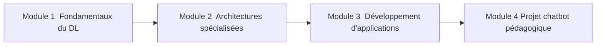

# Carte de progression

## GPS pédagogique : votre itinéraire d'apprentissage du Deep Learning

Cette carte de progression vous permettra de visualiser clairement les objectifs, les activités et les compétences développées à chaque étape de votre formation en Deep Learning.

## Les 4 modules du parcours

## Module 1 : Fondamentaux du Deep Learning

**Concepts clés :**
- Structure et fonctionnement d'un neurone artificiel
- Réseaux de neurones multicouches
- Forward et backpropagation
- Fonctions d'activation (ReLU, Sigmoid, Softmax)
- Différences fondamentales entre Machine Learning classique et Deep Learning

**Activités pratiques :**
- Manipulation d'un réseau de neurones sur données MNIST
- Comparaison directe ML vs DL sur le même jeu de données
- Visualisation des couches internes d'un réseau

**Auto-évaluation :**
- QCM sur les concepts fondamentaux
- Schéma conceptuel à compléter
- Analyse critique des résultats obtenus

**Livrables :**
- Notebook "Hello World du Deep Learning" complété
- Schéma annoté d'un réseau de neurones

## Module 2 : Architectures spécialisées

**Concepts clés pour les CNN :**
- Convolution et filtres
- Pooling et réduction de dimension
- Feature maps et leur interprétation
- Transfer learning avec modèles pré-entraînés

**Concepts clés pour les RNN :**
- Traitement de séquences et données temporelles
- Problème de la disparition du gradient
- Cellules LSTM et GRU
- Applications au traitement du langage naturel

**Auto-évaluation :**
- QCM sur les architectures CNN et RNN
- Analyse de performance des modèles
- Questions à réponse courte sur l'intégration pratique

**Activités pratiques :**
- Implémentation d'un CNN pour la classification d'images
- Développement d'un RNN pour l'analyse de sentiment
- Optimisation d'un modèle de prévision des ventes

## Module 3 : Développement d'applications pratiques

**Concepts clés :**
- TensorFlow/Keras : modèles fonctionnels et séquentiels
- Optimisation des hyperparamètres
- Techniques de régularisation (dropout, batch normalization)
- API REST pour servir des modèles
- Intégration de modèles de langage (API Mistral)

**Auto-évaluation :**
- QCM sur les frameworks et l'optimisation
- Exercice pratique de développement d'API
- Cas concret d'intégration de modèles

**Activités pratiques :**
- Utilisation de modèles pré-entraînés
- Optimisation des performances d'inférence
- Premier test d'intégration avec l'API Mistral
- Conception du prototype de chatbot

## Module 4 : Projet intégrateur - Chatbot pédagogique

**Concepts clés :**
- Prompt engineering pour modèles de langage
- Gestion du contexte conversationnel
- Structures de données pour bases de connaissances
- Optimisation de l'expérience utilisateur
- Techniques de déploiement

**Auto-évaluation :**
- QCM sur la conception et l'architecture du chatbot
- Exercice pratique sur la gestion du contexte
- Analyse de performance des optimisations

**Activités pratiques :**
- Développement d'une interface conversationnelle
- Intégration avancée avec l'API Mistral
- Structuration d'une base de connaissances
- Tests et optimisation de l'expérience utilisateur

## Ce que vous saurez faire après chaque module

### Après le Module 1
- Expliquer le fonctionnement d'un réseau de neurones de base
- Distinguer ML classique et Deep Learning dans des cas concrets
- Implémenter un réseau simple pour la classification d'images
- Interpréter les métriques d'entraînement (précision, perte)

### Après le Module 2
- Implémenter et adapter un CNN pour la vision par ordinateur
- Développer un RNN pour des tâches de traitement de texte
- Visualiser et interpréter les feature maps d'un CNN
- Améliorer un modèle existant avec différentes techniques

### Après le Module 3
- Utiliser efficacement TensorFlow/Keras pour créer des modèles
- Appliquer des techniques d'optimisation des performances
- Intégrer l'API Mistral dans une application simple
- Concevoir l'architecture d'un chatbot pédagogique

### Après le Module 4
- Développer un chatbot pédagogique complet et fonctionnel
- Créer et gérer une base de connaissances structurée
- Optimiser l'expérience utilisateur d'un système conversationnel
- Présenter et défendre un projet technique

## Concepts clés du Deep Learning à travers le parcours

- **Neurones artificiels et réseaux** → Module 1
- **Descente de gradient et rétropropagation** → Module 1
- **Convolution et vision par ordinateur** → Module 2
- **Mémoire récurrente et séquences** → Module 2
- **Optimisation et hyperparamètres** → Module 3
- **Modèles de langage et génération de texte** → Module 3, 4
- **Systèmes conversationnels** → Module 4
- **Architectures d'applications IA** → Module 4

## Ressources essentielles

- **Documentation TensorFlow/Keras** - [tensorflow.org/tutorials](https://www.tensorflow.org/tutorials)
- **API Mistral** - [docs.mistral.ai](https://docs.mistral.ai/)
- **Hugging Face** - [huggingface.co/docs](https://huggingface.co/docs)
- **FastAPI** - [fastapi.tiangolo.com](https://fastapi.tiangolo.com/)

## Auto-évaluation et progression

Pour suivre efficacement votre progression :
- Complétez chaque QCM à la fin du module correspondant
- Analysez vos résultats pour identifier vos points forts et points à améliorer
- Révisez les concepts pour lesquels vous avez obtenu un score inférieur à 70%
- N'hésitez pas à refaire les QCM après avoir approfondi les sujets concerné

[Retour à l'accueil](index.md){ .md-button }
[Commencer le Module 1](module1/index.md){ .md-button .md-button--primary }