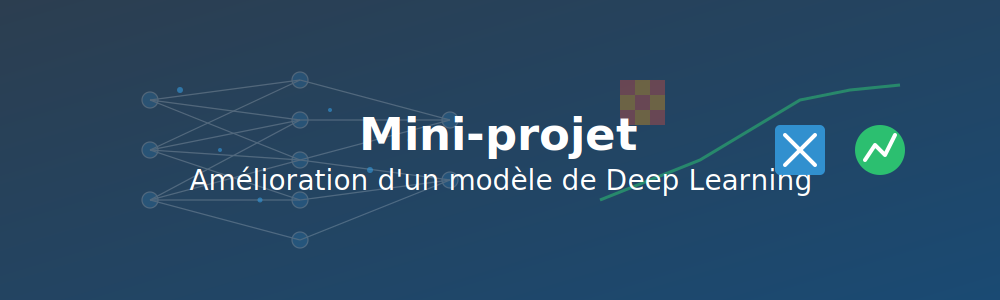

# 🛠️ Phase 3 : Mini-projet individuel (1h)



## 🎯 Objectifs

Ce mini-projet individuel vous permettra de :

- Appliquer les connaissances acquises sur les réseaux de neurones
- Expérimenter avec différentes architectures et hyperparamètres 
- Comprendre l'impact des modifications sur les performances
- Documenter vos observations dans une fiche structurée

## 📋 Fiche d'observations à compléter

> **IMPORTANT** : Tout au long de ce mini-projet, vous devrez compléter la **Fiche d'observations** disponible ci-dessous. Ce document sera votre livrable principal.
>
> 📥 **Téléchargez et consultez la 📋 [fiche d'observations](ressources/Partie1-Phase3-fiche-observations.md) dès maintenant** pour comprendre les éléments à observer et à documenter pendant le mini-projet.

## 📝 Déroulement du mini-projet

### Étape 1 : Modèle de base (15 min)

1. **Créez un nouveau notebook** dans Google Colab
2. **Copiez-collez le code du modèle de base** ci-dessous
3. **Exécutez le code** pour voir la performance initiale

```python
import numpy as np
import matplotlib.pyplot as plt
import tensorflow as tf
from tensorflow.keras.datasets import mnist
from tensorflow.keras.models import Sequential
from tensorflow.keras.layers import Dense, Flatten, Conv2D, MaxPooling2D
from tensorflow.keras.utils import to_categorical

# Charger les données
(X_train, y_train), (X_test, y_test) = mnist.load_data()

# Prétraiter les données
X_train = X_train.reshape(-1, 28, 28, 1) / 255.0
X_test = X_test.reshape(-1, 28, 28, 1) / 255.0
y_train_cat = to_categorical(y_train, 10)
y_test_cat = to_categorical(y_test, 10)

# Créer le modèle de base
model = Sequential([
    Conv2D(32, kernel_size=(3, 3), activation='relu', input_shape=(28, 28, 1)),
    MaxPooling2D(pool_size=(2, 2)),
    Flatten(),
    Dense(128, activation='relu'),
    Dense(10, activation='softmax')
])

# Compiler le modèle
model.compile(optimizer='adam', loss='categorical_crossentropy', metrics=['accuracy'])

# Afficher le résumé du modèle
model.summary()

# Entraîner le modèle
history = model.fit(
    X_train, y_train_cat,
    epochs=3,  # Peu d'époques pour aller vite
    batch_size=128,
    validation_split=0.2,
    verbose=1
)

# Évaluer le modèle
test_loss, test_acc = model.evaluate(X_test, y_test_cat)
print(f"Précision sur les données de test : {test_acc*100:.2f}%")

# Visualiser l'évolution de l'apprentissage
plt.figure(figsize=(12, 4))
plt.subplot(1, 2, 1)
plt.plot(history.history['accuracy'], label='Entraînement')
plt.plot(history.history['val_accuracy'], label='Validation')
plt.title('Précision du modèle')
plt.xlabel('Époque')
plt.ylabel('Précision')
plt.legend()

plt.subplot(1, 2, 2)
plt.plot(history.history['loss'], label='Entraînement')
plt.plot(history.history['val_loss'], label='Validation')
plt.title('Perte (loss)')
plt.xlabel('Époque')
plt.ylabel('Perte')
plt.legend()
plt.tight_layout()
plt.show()
```

### Étape 2 : Améliorations du modèle (30 min)

Choisissez **au moins 2 modifications** parmi les propositions suivantes et notez vos observations sur votre fiche :

#### Modification A : Ajouter une couche de convolution
```python
model = Sequential([
    Conv2D(32, kernel_size=(3, 3), activation='relu', input_shape=(28, 28, 1)),
    MaxPooling2D(pool_size=(2, 2)),
    Conv2D(64, kernel_size=(3, 3), activation='relu'),  # Couche ajoutée
    MaxPooling2D(pool_size=(2, 2)),  # Pooling ajouté
    Flatten(),
    Dense(128, activation='relu'),
    Dense(10, activation='softmax')
])
```

#### Modification B : Ajouter plus de neurones
```python
model = Sequential([
    Conv2D(32, kernel_size=(3, 3), activation='relu', input_shape=(28, 28, 1)),
    MaxPooling2D(pool_size=(2, 2)),
    Flatten(),
    Dense(256, activation='relu'),  # 256 au lieu de 128
    Dense(10, activation='softmax')
])
```

#### Modification C : Ajouter du Dropout pour réduire le surapprentissage
```python
from tensorflow.keras.layers import Dropout

model = Sequential([
    Conv2D(32, kernel_size=(3, 3), activation='relu', input_shape=(28, 28, 1)),
    MaxPooling2D(pool_size=(2, 2)),
    Flatten(),
    Dense(128, activation='relu'),
    Dropout(0.5),  # Ajout d'une couche de Dropout
    Dense(10, activation='softmax')
])
```

#### Modification D : Changer l'optimiseur
```python
from tensorflow.keras.optimizers import SGD

# Compiler le modèle avec SGD au lieu d'Adam
model.compile(
    optimizer=SGD(learning_rate=0.01),  # Utilisation de SGD
    loss='categorical_crossentropy',
    metrics=['accuracy']
)
```

#### Modification E : Augmenter le nombre d'époques d'entraînement
```python
# Entraîner le modèle plus longtemps
history = model.fit(
    X_train, y_train_cat,
    epochs=5,  # 5 au lieu de 3
    batch_size=128,
    validation_split=0.2,
    verbose=1
)
```

### Étape 3 : Analyse des résultats (15 min)

Pour analyser l'impact de vos modifications, ajoutez ce code à votre notebook :

```python
# Visualiser quelques prédictions
def plot_predictions(model, X, y_true, n=10):
    predictions = model.predict(X[:n])
    pred_classes = np.argmax(predictions, axis=1)
    true_classes = np.argmax(y_true[:n], axis=1)
    
    plt.figure(figsize=(15, 3))
    for i in range(n):
        plt.subplot(1, n, i+1)
        plt.imshow(X[i].reshape(28, 28), cmap='gray')
        
        if pred_classes[i] == true_classes[i]:
            color = 'green'
        else:
            color = 'red'
            
        plt.title(f"Vrai: {true_classes[i]}\nPrédit: {pred_classes[i]}", color=color)
        plt.axis('off')
    plt.tight_layout()
    plt.show()

# Tester avec des données normales
plot_predictions(model, X_test, y_test_cat)

# Tester avec des données bruitées
X_test_noisy = X_test + np.random.normal(0, 0.1, X_test.shape)
X_test_noisy = np.clip(X_test_noisy, 0, 1)
plot_predictions(model, X_test_noisy, y_test_cat)
```

## 📊 Éléments à documenter dans votre fiche d'observations

Sur votre fiche d'observations (à télécharger au début du TP), vous devrez remplir :

1. **Modèle de base**
   - Architecture (nombre de couches et de neurones)
   - Performance obtenue (précision sur les données de test)
   - Analyse des courbes d'entraînement

2. **Modifications effectuées**
   - Description de chaque modification
   - Justification de votre choix

3. **Résultats obtenus**
   - Performance après chaque modification
   - Comparaison avec le modèle de base
   - Comportement avec les données bruitées

4. **Analyse et observations**
   - Impact de chaque modification
   - Types d'erreurs observées
   - Votre interprétation des résultats

## 💡 Conseils

- Testez les modifications une par une
- Prenez des notes sur chaque modification dans votre fiche d'observations
- Observez attentivement les courbes d'apprentissage et les prédictions

[Retour au Module 1](index.md){ .md-button }
[Continuer vers l'Auto-évaluation](qcm-evaluation-module1.md){ .md-button .md-button--primary }