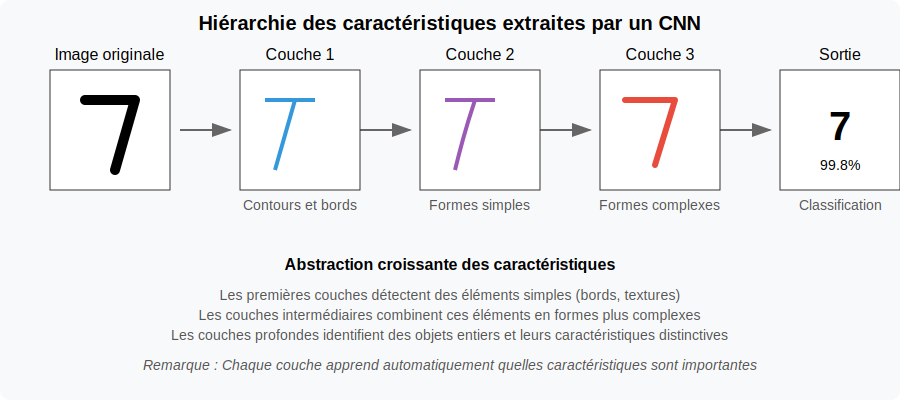
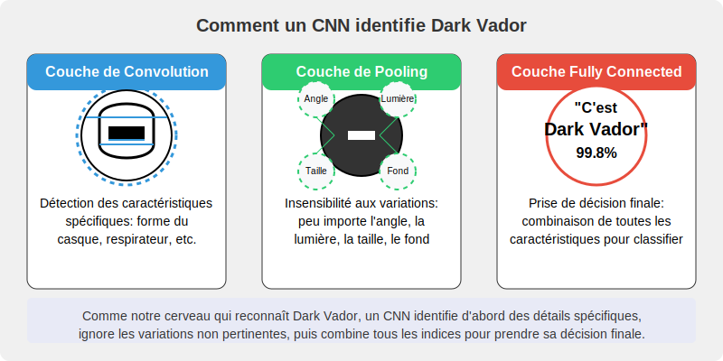

# 🔍 Phase 1 : Mini-projet CNN pour la vision par ordinateur

## Objectifs de la phase

Dans cette phase, vous allez :

- Comprendre les principes fondamentaux des réseaux de neurones convolutifs (CNN)
- Implémenter un CNN pour la classification d'images avec TensorFlow/Keras
- Visualiser et interpréter les filtres et feature maps d'un CNN
- Intégrer un modèle CNN dans une application web simple

## 🧩 Partie 1: Principes des CNN (30 min)

### 🧠Défi de réflexion initiale

Avant de plonger dans les CNN, prenez 2 minutes pour réfléchir à cette question :

> **❓Question à méditer** : Comment reconnaissez-vous un visage dans une photo, quelle que soit sa position ou l'éclairage ? Qu'est-ce qui rend cette tâche si facile pour vous et si difficile pour un ordinateur ?

### Activité guidée : Découverte de l'architecture CNN

**Étape 1 : Observation (3 min)**
Examinez ces deux visualisations en parallèle :

- L'image originale d'un chiffre '7' manuscrit et son traitement par les différentes couches d'un CNN

- Les différentes caractéristiques extraites à chaque niveau d'un CNN déjà entraîné

**Étape 2 : Mini-investigation (5 min)**
Formez des binômes et discutez :

- Quels types de détails la première couche semble-t-elle repérer dans l'image?
- Comment ce que "voit" le réseau change-t-il entre la première et la dernière couche?
- Pourquoi est-il utile pour le réseau de transformer l'image à chaque étape?

Les réseaux de neurones convolutifs (CNN) offrent plusieurs avantages, notamment :

- Extraction automatique des caractéristiques

Contrairement aux méthodes traditionnelles de vision par ordinateur qui nécessitent une extraction manuelle des caractéristiques, les CNN apprennent automatiquement les motifs pertinents (bords, textures, formes) à partir des données.

- Partage des poids et réduction du nombre de paramètres 

Grâce aux filtres de convolution partagés sur toute l'image, les CNN réduisent considérablement le nombre de paramètres à entraîner, ce qui diminue les besoins en mémoire et en calcul par rapport aux réseaux de neurones entièrement connectés.

- Invariance aux translations et robustesse aux variations

Les couches de convolution et de pooling permettent aux CNN d'être robustes aux décalages, rotations et déformations dans les images, ce qui améliore leur capacité à reconnaître des objets dans différentes conditions.

**Étape 3 : Construction du modèle mental (5 min)**
Sur votre feuille de travail, complétez le schéma simplifié d'un CNN :

1. Identifiez et nommez les trois types principaux de couches
2. Pour chaque type, précisez brièvement sa fonction
3. Listez les trois avantages majeurs des CNN

**Étape 4 : Analogie concrète (3 min)**
Pour comprendre le fonctionnement d'un CNN, voyons comment il pourrait identifier un personnage célèbre comme Dark Vador :

- **La couche de convolution** repère les caractéristiques distinctives : "Je détecte un casque noir, un respirateur, une cape..."
- **La couche de pooling** ignore les détails non pertinents : "Peu importe l'angle de vue, l'éclairage, s'il est de face ou de profil..."
- **La couche fully connected** prend la décision finale : "D'après toutes ces caractéristiques combinées, c'est Dark Vador à 99.8%!"

Cette analogie montre comment un CNN analyse une image de manière hiérarchique, comme notre cerveau le fait naturellement.

### Points importants à retenir

> **À savoir avant de passer à la pratique :**
> 
> 1. Les CNN sont conçus spécifiquement pour traiter les données en grille comme les images.
>
> 2. Les filtres de convolution agissent comme des détecteurs de motifs qui s'appliquent à toute l'image.
>
> 3. Le pooling permet de réduire les dimensions tout en conservant l'information importante.
>
> 4. Les poids du réseau sont ajustés automatiquement pendant l'entraînement.
>
> 5. Un CNN profond permet de détecter des motifs de plus en plus complexes et abstraits.
>
> 6. Le grand avantage des CNN est qu'ils apprennent automatiquement les caractéristiques pertinentes, sans qu'on ait à les programmer manuellement.

### Transition vers l'implémentation

Maintenant que vous avez conceptualisé l'architecture d'un CNN, passons à l'implémentation pratique pour voir ces concepts en action. Gardez votre schéma à portée de main - vous pourrez le compléter avec des observations pratiques.

## Partie 2: Implémentation d'un CNN pour MNIST (50 min)

### Instructions

1. Ouvrez le notebook Jupyter [cnn-classification](ressources/cnn-classification.md) dans Google Colab
2. Suivez les instructions étape par étape pour implémenter un CNN pour la classification des chiffres manuscrits (MNIST)
3. Exécutez chaque cellule et observez les résultats
4. Portez une attention particulière aux sections suivantes :
   
     - Architecture du modèle CNN
     - Processus d'entraînement
     - Visualisation des filtres et feature maps
     - Analyse des performances et des erreurs

### Points clés à explorer

- Comment les couches de convolution extraient-elles des caractéristiques de plus en plus abstraites ?
- Quel est l'impact du nombre de filtres et de couches sur les performances ?
- Comment les feature maps révèlent-elles ce que "voit" le réseau ?
- Quelles sont les limites du modèle face à des données bruitées ou déformées ?

## Partie 3: Intégration dans une application web via Google Colab (40 min)

## 🎯 Objectif du mini-projet

Dans cette partie pratique, vous allez créer une application web interactive qui intègre votre modèle CNN pour la reconnaissance de chiffres manuscrits. Ce mini-projet reprend les concepts théoriques vus précédemment et les applique dans un contexte professionnel concret.

## 🚀 Mise en contexte professionnelle 

En tant que stagiaire dans une PME, vous développez un prototype d'application qui permettra d'automatiser la saisie de codes à partir de documents papier, économisant du temps aux employés et réduisant les erreurs de transcription.

## 📋 Structure du projet

Le mini-projet, détaillé dans le document de référence, comprend:

- ⚙️ **Configuration de l'environnement** dans Google Colab
- 🧠 **Entraînement d'un modèle CNN** sur le dataset MNIST 
- 🌐 **Création d'une interface web interactive** avec Flask et ngrok
- 🧪 **Tests et évaluation** de votre application

## 🔍 Éléments à observer et documenter

Pendant vos tests, portez une attention particulière à:

- 📊 Le taux de réussite sur différents types d'entrées (dessin vs image importée)
- 🔍 La visualisation des feature maps et ce qu'elles révèlent du fonctionnement du modèle
- 💡 Les forces et limitations observées dans des conditions réelles d'utilisation

## 📝 Livrable attendu

Vous compléterez la fiche d'observations sur les CNN en documentant les résultats de votre expérimentation. Cette fiche servira de base pour évaluer votre compréhension des réseaux convolutifs et leur application pratique.

Pour les instructions détaillées étape par étape, consultez le document complet [mini-projet-cnn-web-colab.md](ressources/mini-projet-cnn-web-colab.md).

# Ressources complémentaires

- [Tutoriel TensorFlow sur les CNN](https://www.tensorflow.org/tutorials/images/cnn) - Guide officiel de TensorFlow sur l'implémentation des réseaux de neurones convolutifs
- [Visualisation de CNN (Distill.pub)](https://distill.pub/2017/feature-visualization/) - Article interactif sur la visualisation et l'interprétation des réseaux convolutifs
- [Documentation Flask](https://flask.palletsprojects.com/en/2.3.x/) - Documentation officielle du framework Flask pour le développement web

[Retour au Module 2](index.md){ .md-button }
[Continuer vers les Réseaux récurrents](reseaux-recurrents.md){ .md-button .md-button--primary }