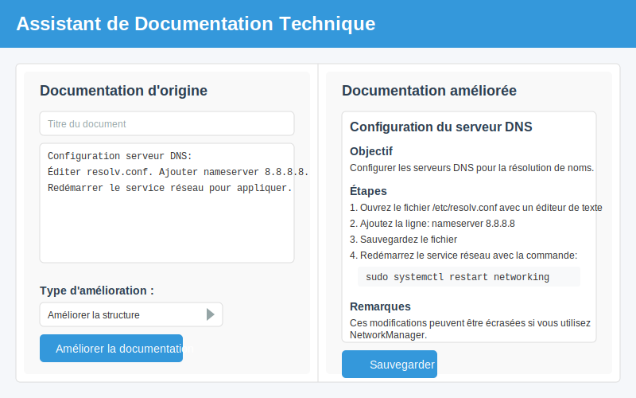

# ⚙️ Phase 2: Assistant de documentation technique (1h30)


## 🎯 Objectif de la phase

Dans cette phase, vous allez :

- Découvrir une application web d'aide à la documentation technique
- Intégrer une API d'IA pour améliorer et générer de la documentation
- Tester l'application avec différents types de documentation informatique
- Adapter l'outil pour des besoins spécifiques en entreprise

## 🔍 Introduction à l'assistant de documentation (30 min)

### Contexte professionnel

La documentation technique est une partie essentielle du travail en informatique, mais souvent chronophage et parfois négligée. Un assistant de documentation intelligent peut :

- Aider à formaliser des procédures techniques
- Améliorer la clarté et la structure d'une documentation existante
- Générer des explications pour les utilisateurs finaux
- Standardiser le format des documentations dans l'entreprise

### Présentation de l'application pré-développée

Notre assistant de documentation est une application web simple qui permet de :

- Rédiger ou importer une documentation technique
- Améliorer automatiquement le style et la clarté
- Générer des instructions étape par étape à partir de descriptions générales
- Convertir une documentation technique en guide utilisateur simplifié



### Démonstration de l'application

Voici un exemple de transformation par l'assistant :

| Documentation d'origine | Documentation améliorée |
|------------------------|------------------------|
| "Pour configurer le serveur DNS, modifiez resolv.conf et redémarrez le service réseau." | **Configuration du serveur DNS**<br>1. Ouvrez le fichier `/etc/resolv.conf` avec un éditeur de texte<br>2. Ajoutez les serveurs DNS avec la syntaxe: `nameserver IP_ADRESSE`<br>3. Sauvegardez le fichier<br>4. Redémarrez le service réseau avec la commande: `sudo systemctl restart networking`<br><br>**Note**: Ces modifications seront perdues au redémarrage si vous utilisez NetworkManager. |

## 📋 Intégration de l'API d'assistance documentaire (1h)

### Exploration du code existant (20 min)

Commençons par explorer le code de l'application :

```python
# app.py - Application principale
from flask import Flask, render_template, request, jsonify
import json
import os

app = Flask(__name__)

# Fonction d'amélioration de la documentation à compléter
def enhance_documentation(text, improvement_type):
    """
    Améliore la documentation technique en utilisant l'API d'IA.
    
    Args:
        text (str): Le texte de la documentation à améliorer
        improvement_type (str): Le type d'amélioration ('structure', 'clarity', 'user_guide')
    
    Returns:
        str: La documentation améliorée
    """
    # Cette fonction doit être complétée pour intégrer l'API d'IA
    # En attendant, elle retourne le texte original
    return text

@app.route('/')
def index():
    return render_template('index.html')

@app.route('/enhance', methods=['POST'])
def enhance():
    # Récupérer les données
    data = request.json
    text = data.get('text', '')
    improvement_type = data.get('type', 'structure')
    
    # Améliorer la documentation
    enhanced_text = enhance_documentation(text, improvement_type)
    
    return jsonify({'enhanced_text': enhanced_text})

@app.route('/save', methods=['POST'])
def save_doc():
    # Récupérer les données
    data = request.json
    title = data.get('title', 'Document sans titre')
    content = data.get('content', '')
    
    # Créer un nom de fichier sécurisé
    filename = title.lower().replace(' ', '_')[:50] + '.md'
    
    # Sauvegarder dans le dossier docs
    os.makedirs('docs', exist_ok=True)
    with open(os.path.join('docs', filename), 'w') as f:
        f.write(content)
    
    return jsonify({'success': True, 'filename': filename})

if __name__ == '__main__':
    app.run(debug=True)
```

Examinez également le template principal :

```html
<!-- templates/index.html -->
<!DOCTYPE html>
<html>
<head>
    <title>Assistant de Documentation Technique</title>
    <link rel="stylesheet" href="{{ url_for('static', filename='style.css') }}">
</head>
<body>
    <header>
        <h1>Assistant de Documentation Technique</h1>
    </header>
    
    <main>
        <div class="container">
            <div class="input-section">
                <h2>Documentation d'origine</h2>
                <input type="text" id="doc-title" placeholder="Titre du document">
                <textarea id="original-doc" placeholder="Entrez ou collez votre documentation technique ici..."></textarea>
                
                <div class="enhancement-options">
                    <h3>Type d'amélioration :</h3>
                    <select id="enhancement-type">
                        <option value="structure">Améliorer la structure</option>
                        <option value="clarity">Améliorer la clarté</option>
                        <option value="user_guide">Convertir en guide utilisateur</option>
                    </select>
                    
                    <button id="enhance-btn">Améliorer la documentation</button>
                </div>
            </div>
            
            <div class="output-section">
                <h2>Documentation améliorée</h2>
                <div id="enhanced-doc" class="enhanced-content">
                    <p>La documentation améliorée s'affichera ici...</p>
                </div>
                
                <button id="save-btn" disabled>Sauvegarder</button>
            </div>
        </div>
    </main>
    
    <script src="{{ url_for('static', filename='script.js') }}"></script>
</body>
</html>
```

### Implémentation de l'amélioration documentaire (20 min)

Complétez la fonction `enhance_documentation` pour intégrer l'API d'IA :

```python
# Code à compléter dans app.py
import requests

def enhance_documentation(text, improvement_type):
    """
    Améliore la documentation technique en utilisant l'API d'IA.
    
    Args:
        text (str): Le texte de la documentation à améliorer
        improvement_type (str): Le type d'amélioration ('structure', 'clarity', 'user_guide')
    
    Returns:
        str: La documentation améliorée
    """
    # Configuration de l'API (clé fournie en cours)
    api_key = "VOTRE_CLE_API"  # À remplacer par la clé fournie
    api_url = "https://api.example.com/text/enhance"
    
    # Définir les prompts selon le type d'amélioration
    prompts = {
        'structure': "Restructure cette documentation technique en sections claires avec des titres, des listes à puces et des étapes numérotées :",
        'clarity': "Améliore la clarté de cette documentation technique en ajoutant des détails, en expliquant les termes techniques et en utilisant un langage plus précis :",
        'user_guide': "Convertis cette documentation technique en un guide utilisateur simple à comprendre pour des non-techniciens :"
    }
    
    prompt = prompts.get(improvement_type, prompts['structure'])
    
    # Préparation des données
    data = {
        "prompt": prompt,
        "text": text,
        "format": "markdown"
    }
    
    headers = {
        "Authorization": f"Bearer {api_key}",
        "Content-Type": "application/json"
    }
    
    try:
        # Appel à l'API
        response = requests.post(api_url, json=data, headers=headers)
        response.raise_for_status()  # Vérifier si l'appel a réussi
        
        result = response.json()
        
        return result["enhanced_text"]
        
    except Exception as e:
        print(f"Erreur lors de l'amélioration: {e}")
        return f"**Erreur lors de l'amélioration**\n\nTexte original:\n\n{text}"
```

### Test et adaptation pour documentation (20 min)

Testez l'application avec différents types de documentation informatique :

**Documentation système :**
```
Installation de l'antivirus sur les postes clients: 
Télécharger l'installateur. Désactiver l'ancien antivirus. 
Lancer setup.exe. Accepter la licence. Choisir installation complète. 
Redémarrer. Vérifier que le service est actif.
```

**Documentation réseau :**
```
Configuration VLAN:
Pour configurer les VLANs, on utilise la commande switchport.
Les ports d'accès doivent être configurés avec mode access.
Les ports trunk permettent de faire passer plusieurs VLANs.
Il faut configurer les interfaces et définir le VLAN natif.
```

**Documentation développement :**
```
API d'authentification:
L'API d'auth expose /login, /register et /reset.
Utiliser des requêtes POST avec Content-Type application/json.
Les tokens JWT doivent être inclus dans l'en-tête Authorization.
La validation se fait côté serveur avec middleware.
```

### Adaptez l'application pour des besoins spécifiques (20 min)

Ajoutez un nouveau type d'amélioration :

```python
# Ajout d'un type d'amélioration spécifique 
def enhance_documentation(text, improvement_type):
    # Configuration de l'API (inchangée)
    
    # Définir les prompts avec ajout d'un type spécifique 
    prompts = {
        'structure': "Restructure cette documentation technique en sections claires avec des titres, des listes à puces et des étapes numérotées :",
        'clarity': "Améliore la clarté de cette documentation technique en ajoutant des détails, en expliquant les termes techniques et en utilisant un langage plus précis :",
        'user_guide': "Convertis cette documentation technique en un guide utilisateur simple à comprendre pour des non-techniciens :",
        'procedure': "Convertis cette documentation en procédure technique standard pour technicien, incluant: objectif, prérequis, étapes détaillées, vérification, dépannage courant et références:"
    }
    # Reste du code inchangé
```

Mettez également à jour le template HTML pour inclure cette nouvelle option : 

```html
<!-- Ajout dans le select des types d'amélioration -->
<select id="enhancement-type">
    <option value="structure">Améliorer la structure</option>
    <option value="clarity">Améliorer la clarté</option>
    <option value="user_guide">Convertir en guide utilisateur</option>
    <option value="procedure">Procédure standard SIO</option>
</select>
```

## 📝 Conclusion et transition

Dans cette deuxième phase, vous avez découvert comment intégrer une API d'IA dans une application d'aide à la documentation technique. Cet outil peut considérablement améliorer votre efficacité en entreprise en vous aidant à produire des documentations de qualité plus rapidement.

Vous avez également appris à adapter l'outil pour des besoins spécifiques, notamment en créant un type d'amélioration dédié aux procédures techniques standard.

Dans la prochaine phase, nous explorerons les bases d'un chatbot d'assistance informatique, qui sera le fondement de votre projet final.

N'oubliez pas de compléter la deuxième partie de votre fiche d'observations avec vos tests et adaptations de l'assistant de documentation.

[Retour au Module 3](index.md){ .md-button }
[Passer au Module 4](../module4/index.md){ .md-button .md-button--primary }