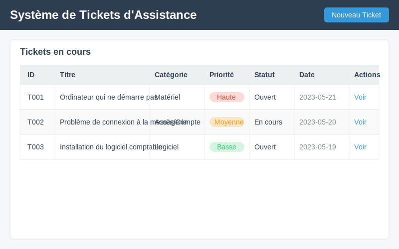

# 🔍 Phase 1: Système de tickets intelligent (2h)


## 🎯 Objectifs de la phase

Dans cette phase, vous allez :

- Explorer un système de tickets d'assistance pré-développé
- Comprendre comment une API d'IA peut classifier automatiquement les demandes
- Développer progressivement une fonction de classification simple puis avancée
- Adapter l'outil pour un contexte professionnel spécifique

## 🔍 Introduction au système de tickets (20 min)

### Qu'est-ce qu'un système de tickets ?

Un système de tickets est un outil essentiel pour la gestion du support informatique en entreprise. Il permet de :

- **Centraliser** toutes les demandes d'assistance au même endroit
- **Organiser** les demandes par catégorie et priorité
- **Suivre** l'évolution de chaque problème jusqu'à sa résolution
- **Analyser** les types de problèmes récurrents pour amélioration continue

### Comment l'IA améliore le processus

Traditionnellement, la classification des tickets était manuelle, ce qui posait plusieurs problèmes :
- Perte de temps pour le technicien qui doit analyser et catégoriser
- Risque d'erreurs ou d'incohérences dans la classification
- Retard dans la prise en charge des problèmes critiques

**L'IA apporte ces améliorations :**
- Classification automatique dès la soumission du ticket
- Estimation de la priorité basée sur le contenu
- Cohérence dans l'organisation des demandes
- Orientation plus rapide vers le bon technicien

### Démonstration du système

Voici à quoi ressemble notre système de tickets :



**Exemple :** Quand un utilisateur soumet le ticket "Mon ordinateur ne s'allume plus depuis ce matin", le système :
1. Analyse le texte de la demande
2. Le catégorise comme "Matériel"
3. Lui attribue une priorité "Haute" (problème bloquant)
4. L'affiche dans la liste des tickets avec ces informations

## 📝 Documentation de vos observations

N'oubliez pas de compléter votre [fiche d'observations](../ressources/Partie3-Phase1-fiche-observations-tickets.md) avec :

- Les résultats de vos tests de classification
- L'analyse de votre logique de priorité 
- Les adaptations réalisées pour le contexte d'entreprise
- Vos réflexions sur les applications professionnelles

Cette documentation sera essentielle pour l'évaluation de votre travail


## 🧩 Structure de l'application (15 min)

Notre système de tickets est une application web simple construite avec Flask. Voici sa structure :

```
systeme-tickets/
│
├── app.py                  # Application principale
├── templates/              # Fichiers HTML pour l'interface
│   ├── index.html          # Page d'accueil avec liste des tickets
│   ├── new_ticket.html     # Formulaire de création de ticket
│   └── ticket_detail.html  # Page de détail d'un ticket
│
├── static/                 # Fichiers CSS et JavaScript
│   └── style.css
│
└── tickets.json            # Base de données des tickets (fichier simple)
```

### Fonctionnement général

L'application utilise une architecture simple :

1. **Frontend** : HTML/CSS pour l'interface utilisateur
2. **Backend** : Python/Flask pour la logique métier
3. **Stockage** : Fichier JSON pour les données (pour simplifier)

Le flux de travail principal est :
- L'utilisateur remplit un formulaire de demande
- L'application analyse et classifie la demande
- Le ticket est enregistré et affiché dans la liste

## 📋 Exploration du code existant (25 min)

Examinons le code principal de l'application :

```python
# app.py - Application principale
from flask import Flask, request, render_template, redirect, url_for
import json
from datetime import datetime

app = Flask(__name__)

# Charger les tickets existants
def load_tickets():
    try:
        with open('tickets.json', 'r') as f:
            return json.load(f)
    except (FileNotFoundError, json.JSONDecodeError):
        return []

# Sauvegarder les tickets
def save_tickets(tickets):
    with open('tickets.json', 'w') as f:
        json.dump(tickets, f, indent=4)

# Fonction de classification à compléter
def classify_ticket(description):
    # Cette fonction doit être complétée pour intégrer l'API d'IA
    # En attendant, elle retourne une catégorie par défaut
    return {
        "category": "Non classé",
        "priority": "Moyenne",
        "confidence": 0.0
    }

@app.route('/')
def index():
    tickets = load_tickets()
    return render_template('index.html', tickets=tickets)

@app.route('/new', methods=['GET', 'POST'])
def new_ticket():
    if request.method == 'POST':
        title = request.form['title']
        description = request.form['description']
        
        # Classifier le ticket
        classification = classify_ticket(description)
        
        # Créer le nouveau ticket
        ticket = {
            'id': datetime.now().strftime('%Y%m%d%H%M%S'),
            'title': title,
            'description': description,
            'category': classification['category'],
            'priority': classification['priority'],
            'status': 'Ouvert',
            'created_at': datetime.now().strftime('%Y-%m-%d %H:%M:%S'),
            'comments': []
        }
        
        # Sauvegarder
        tickets = load_tickets()
        tickets.append(ticket)
        save_tickets(tickets)
        
        return redirect(url_for('index'))
    
    return render_template('new_ticket.html')
```

### Points clés à comprendre

1. **Fonction `classify_ticket`** : C'est la fonction que nous allons développer pour classifier automatiquement les tickets.

2. **Création de ticket** : La route `/new` récupère les informations du formulaire, utilise la fonction de classification, puis crée et sauvegarde le ticket.

3. **Stockage simple** : L'application utilise un fichier JSON pour stocker les tickets, ce qui est suffisant pour notre exemple.

> 💡 **Observation** : Remarquez que la fonction `classify_ticket` est actuellement vide et retourne simplement une catégorie par défaut. C'est cette fonction que nous allons enrichir progressivement.

## 🚀 Développement progressif de la classification (1h)

Nous allons développer la fonction de classification en trois étapes :

1. Classification basique par mots-clés
2. Ajout d'une logique de priorité
3. Intégration d'une API d'IA

### Étape 1 : Classification par mots-clés (20 min)

Commençons par une approche simple : classifier les tickets en fonction de mots-clés présents dans la description.

```python
def classify_ticket(description):
    """
    Classifie un ticket en fonction des mots-clés présents dans sa description.
    
    Args:
        description (str): La description du ticket
        
    Returns:
        dict: Dictionnaire contenant la catégorie, la priorité et le niveau de confiance
    """
    # Définir les mots-clés pour chaque catégorie
    categories = {
        "Matériel": ["ordinateur", "écran", "souris", "clavier", "imprimante", "scanner", "PC", "batterie", "câble"],
        "Logiciel": ["programme", "logiciel", "application", "windows", "office", "excel", "word", "installer", "désinstaller", "bug"],
        "Réseau": ["wifi", "internet", "connexion", "réseau", "ethernet", "IP", "DNS", "serveur", "intranet", "débit"],
        "Accès / Compte": ["mot de passe", "identifiant", "compte", "login", "accès", "droits", "permission", "utilisateur"],
        "Autre": []  # Catégorie par défaut
    }
    
    # Conversion en minuscules pour faciliter la recherche
    description_lower = description.lower()
    
    # Recherche des mots-clés dans chaque catégorie
    matched_categories = {}
    
    for category, keywords in categories.items():
        matches = 0
        for keyword in keywords:
            if keyword.lower() in description_lower:
                matches += 1
        
        if matches > 0:
            matched_categories[category] = matches
    
    # Si aucune correspondance, retourner "Autre"
    if not matched_categories:
        return {
            "category": "Autre",
            "priority": "Moyenne",
            "confidence": 0.5
        }
    
    # Trouver la catégorie avec le plus de correspondances
    best_category = max(matched_categories, key=matched_categories.get)
    
    # Calculer un niveau de confiance basique (entre 0.6 et 0.9)
    total_keywords = sum(len(keywords) for keywords in categories.values())
    confidence = 0.6 + (0.3 * matched_categories[best_category] / len(categories[best_category])) if len(categories[best_category]) > 0 else 0.6
    
    return {
        "category": best_category,
        "priority": "Moyenne",  # Priorité par défaut, à améliorer
        "confidence": round(confidence, 2)
    }
```

#### 🧪 Test de la classification par mots-clés

Créons une fonction de test pour vérifier notre classification :

```python
def test_classification():
    """
    Teste la fonction de classification avec différents exemples.
    """
    test_cases = [
        "Mon ordinateur ne démarre plus après la mise à jour Windows",
        "Je n'arrive pas à me connecter au réseau wifi de l'entreprise",
        "J'ai besoin d'installer Excel sur mon poste de travail",
        "J'ai oublié mon mot de passe pour accéder à l'intranet",
        "La souris de mon PC ne fonctionne plus correctement"
    ]
    
    print("=== Tests de classification ===")
    for case in test_cases:
        result = classify_ticket(case)
        print(f"\nDescription: '{case}'")
        print(f"Catégorie: {result['category']}")
        print(f"Priorité: {result['priority']}")
        print(f"Confiance: {result['confidence']}")
        print("-" * 50)

# Exécutez cette fonction pour tester
test_classification()
```

### Étape 2 : Ajout d'une logique de priorité (20 min)

Maintenant, améliorons notre fonction pour déterminer la priorité du ticket en fonction du contenu et de la catégorie.

```python
def determine_priority(description, category):
    """
    Détermine la priorité d'un ticket en fonction de sa description et de sa catégorie.
    
    Args:
        description (str): La description du ticket
        category (str): La catégorie du ticket
        
    Returns:
        str: La priorité du ticket ("Haute", "Moyenne" ou "Basse")
    """
    # Conversion en minuscules
    description_lower = description.lower()
    
    # Mots-clés indiquant une priorité haute
    high_priority_keywords = [
        "urgent", "critique", "bloqué", "impossible", 
        "ne fonctionne pas", "erreur", "panne", "problème"
    ]
    
    # Mots-clés indiquant une priorité basse
    low_priority_keywords = [
        "comment", "question", "demande", "information",
        "possible", "amélioration", "suggestion"
    ]
    
    # Vérifier les mots-clés de haute priorité
    for keyword in high_priority_keywords:
        if keyword in description_lower:
            return "Haute"
    
    # Vérifier les mots-clés de basse priorité
    for keyword in low_priority_keywords:
        if keyword in description_lower:
            return "Basse"
    
    # Priorité par défaut basée sur la catégorie
    category_priorities = {
        "Matériel": "Moyenne",
        "Logiciel": "Basse",
        "Réseau": "Haute",  # Problèmes réseau souvent plus critiques
        "Accès / Compte": "Moyenne",
        "Autre": "Basse"
    }
    
    return category_priorities.get(category, "Moyenne")
```

Maintenant, intégrons cette fonction dans notre fonction de classification :

```python
def classify_ticket(description):
    # ... (code précédent pour la classification)
    
    # Trouver la catégorie avec le plus de correspondances
    best_category = max(matched_categories, key=matched_categories.get)
    
    # Calculer un niveau de confiance basique
    confidence = 0.6 + (0.3 * matched_categories[best_category] / len(categories[best_category])) if len(categories[best_category]) > 0 else 0.6
    
    # Déterminer la priorité
    priority = determine_priority(description, best_category)
    
    return {
        "category": best_category,
        "priority": priority,
        "confidence": round(confidence, 2)
    }
```

#### 🔍 Essayez avec des exemples

Testez à nouveau votre fonction avec différents exemples pour voir comment la priorité est déterminée. Ajoutez des cas comme :

- "URGENT: Le serveur principal est en panne"
- "Question : Comment installer Microsoft Teams ?"
- "Le réseau est très lent depuis ce matin"

### Étape 3 : Préparation pour l'intégration API (20 min)

Maintenant, préparons notre code pour l'intégration d'une API d'IA. Dans un environnement réel, nous utiliserions une API comme celle de Mistral AI ou OpenAI, mais pour cet exercice, nous allons simuler une API avec une structure similaire.

```python
import requests
import json
import os
from dotenv import load_dotenv

# Charger les variables d'environnement (pour la clé API)
load_dotenv()

def classify_ticket_with_api(description):
    """
    Classifie un ticket en utilisant une API d'IA (simulation pour cet exercice).
    
    Args:
        description (str): La description du ticket
        
    Returns:
        dict: Dictionnaire contenant la catégorie, la priorité et le niveau de confiance
    """
    # En situation réelle, on utiliserait une clé API stockée dans les variables d'environnement
    # api_key = os.getenv("API_KEY")
    
    # Simulation d'une requête API
    try:
        # Dans un cas réel, on ferait une requête comme celle-ci:
        # response = requests.post(
        #     "https://api.exemple.com/classify",
        #     headers={"Authorization": f"Bearer {api_key}"},
        #     json={"text": description}
        # )
        # result = response.json()
        
        # Pour l'exercice, nous utilisons notre fonction locale
        # mais avec la structure qu'aurait une réponse d'API
        classification = classify_ticket(description)
        
        # Simuler une réponse API
        result = {
            "result": {
                "category": classification["category"],
                "confidence": classification["confidence"]
            }
        }
        
        # Déterminer la priorité
        priority = determine_priority(description, result["result"]["category"])
        
        return {
            "category": result["result"]["category"],
            "priority": priority,
            "confidence": result["result"]["confidence"]
        }
        
    except Exception as e:
        print(f"Erreur lors de la communication avec l'API: {e}")
        # En cas d'erreur, utiliser notre classification locale comme fallback
        return classify_ticket(description)
```

#### 🛠️ Structure pour l'API réelle

Dans un contexte réel, voici comment vous pourriez structurer l'appel à une API d'IA :

```python
def classify_with_real_api(description):
    """
    Exemple d'intégration avec une API d'IA réelle.
    """
    api_key = os.getenv("API_KEY")  # Récupérer la clé depuis les variables d'environnement
    api_url = "https://api.mistral.ai/v1/classify"  # URL fictive
    
    categories = ["Matériel", "Logiciel", "Réseau", "Accès / Compte", "Autre"]
    
    try:
        # Préparation des données
        data = {
            "text": description,
            "categories": categories
        }
        
        # En-têtes de la requête
        headers = {
            "Authorization": f"Bearer {api_key}",
            "Content-Type": "application/json"
        }
        
        # Envoi de la requête à l'API
        response = requests.post(api_url, json=data, headers=headers)
        response.raise_for_status()  # Lève une exception si la requête échoue
        
        # Traitement de la réponse
        result = response.json()
        
        # Structure typique d'une réponse d'API
        # {
        #   "category": "Réseau",
        #   "confidence": 0.85,
        #   "alternatives": [{"category": "Matériel", "confidence": 0.12}, ...]
        # }
        
        # Déterminer la priorité
        priority = determine_priority(description, result["category"])
        
        return {
            "category": result["category"],
            "priority": priority,
            "confidence": result["confidence"]
        }
    
    except Exception as e:
        print(f"Erreur API: {e}")
        # Fallback vers notre classification locale
        return classify_ticket(description)
```

> 💡 **Note** : Dans le contexte du cours, l'instructeur vous fournira la vraie API à utiliser, avec sa documentation et sa clé d'accès.

## 🔧 Personnalisation du système (30 min)

Maintenant que nous avons une fonction de classification fonctionnelle, personnalisons notre système pour un contexte d'entreprise spécifique.

### Adaptation des catégories

Imaginons que nous développons ce système pour une entreprise de services informatiques avec des équipes spécialisées. Adaptons les catégories en conséquence :

```python
def classify_ticket_for_enterprise(description):
    """
    Classifie un ticket avec des catégories adaptées à notre entreprise.
    """
    # Catégories personnalisées
    categories = {
        "Poste de travail": ["ordinateur", "PC", "écran", "souris", "clavier", "batterie", "câble", "Windows", "Office"],
        "Applications métier": ["ERP", "CRM", "logiciel", "application", "métier", "sage", "SAP", "base de données"],
        "Infrastructure réseau": ["serveur", "réseau", "wifi", "ethernet", "connexion", "internet", "lenteur", "VPN"],
        "Sécurité": ["virus", "malware", "phishing", "mot de passe", "accès", "autorisation", "droits"],
        "Demande d'équipement": ["nouveau", "commande", "besoin", "demande", "équipement", "achat"],
        "Support utilisateur": ["formation", "aide", "question", "comment", "tutoriel", "guide"]
    }
    
    # Utiliser la même logique que précédemment, mais avec nos nouvelles catégories
    # ...
```

### Modification de la logique de priorité

Adaptons également la logique de priorité pour ce contexte d'entreprise :

```python
def determine_enterprise_priority(description, category):
    """
    Logique de priorité adaptée à notre entreprise.
    """
    # Mots-clés de priorité haute
    high_priority = ["urgent", "critique", "bloqué", "production", "client", "direction", "impossible", "sécurité"]
    
    # Priorités par défaut selon la catégorie
    category_priorities = {
        "Poste de travail": "Moyenne",
        "Applications métier": "Haute",  # Critique pour le business
        "Infrastructure réseau": "Haute",
        "Sécurité": "Haute",
        "Demande d'équipement": "Basse",
        "Support utilisateur": "Moyenne"
    }
    
    # Vérifier les mots-clés de haute priorité
    for keyword in high_priority:
        if keyword.lower() in description.lower():
            return "Haute"
    
    # Logique supplémentaire : détection du niveau hiérarchique
    if any(term in description.lower() for term in ["directeur", "manager", "chef", "responsable"]):
        # Augmenter la priorité d'un niveau
        if category_priorities.get(category, "Moyenne") == "Moyenne":
            return "Haute"
    
    return category_priorities.get(category, "Moyenne")
```

### Intégration dans l'application

Pour intégrer ces modifications dans l'application principale :

```python
@app.route('/new', methods=['GET', 'POST'])
def new_ticket():
    if request.method == 'POST':
        title = request.form['title']
        description = request.form['description']
        
        # Utiliser notre fonction personnalisée
        classification = classify_ticket_for_enterprise(description)
        
        # Créer le ticket avec la classification personnalisée
        ticket = {
            'id': datetime.now().strftime('%Y%m%d%H%M%S'),
            'title': title,
            'description': description,
            'category': classification['category'],
            'priority': classification['priority'],
            'status': 'Ouvert',
            'created_at': datetime.now().strftime('%Y-%m-%d %H:%M:%S'),
            'comments': []
        }
        
        # Ajouter une logique d'assignation basée sur la catégorie
        ticket['assigned_to'] = assign_to_team(classification['category'])
        
        # Sauvegarder
        tickets = load_tickets()
        tickets.append(ticket)
        save_tickets(tickets)
        
        return redirect(url_for('index'))
    
    return render_template('new_ticket.html')

def assign_to_team(category):
    """
    Assigne le ticket à l'équipe appropriée selon la catégorie.
    """
    team_mapping = {
        "Poste de travail": "Équipe Support Niveau 1",
        "Applications métier": "Équipe Applications",
        "Infrastructure réseau": "Équipe Infrastructure",
        "Sécurité": "Équipe Sécurité",
        "Demande d'équipement": "Équipe Logistique",
        "Support utilisateur": "Équipe Support Niveau 1"
    }
    
    return team_mapping.get(category, "Non assigné")
```

## 📝 Conclusion et réflexion (15 min)

Dans cette phase, vous avez exploré et développé progressivement un système de tickets intelligent avec classification automatique des demandes. Vous avez appris à :

- Créer une fonction de classification basée sur des mots-clés
- Développer une logique de priorité adaptative
- Préparer l'intégration d'une API d'IA
- Personnaliser le système pour un contexte d'entreprise spécifique

### 🧩 Points clés à retenir

- La classification automatique permet un gain de temps considérable dans le traitement des demandes
- Une approche progressive (mots-clés → API) permet de construire et de comprendre la solution étape par étape
- L'adaptation au contexte spécifique d'une entreprise est essentielle pour que le système soit vraiment utile

### 🚀 Applications professionnelles

Ces compétences peuvent être appliquées dans divers contextes professionnels :
- Services d'assistance informatique (helpdesk)
- Gestion des demandes clients
- Automatisation du traitement des emails
- Systèmes de support pour les applications métier

### ✅ Exercices supplémentaires

Si vous souhaitez approfondir :
1. Ajoutez une fonction pour suggérer des solutions automatiques pour certains types de problèmes
2. Implémentez un système de notification par email selon la priorité du ticket
3. Créez une visualisation (graphique) des tickets par catégorie et priorité

N'oubliez pas de compléter la première partie de votre fiche d'observations avec vos tests et adaptations.

[Retour au Module 3](index.md){ .md-button }
[Continuer vers la Phase 2: Assistant de documentation technique](assistant-documentation.md){ .md-button .md-button--primary }
```
